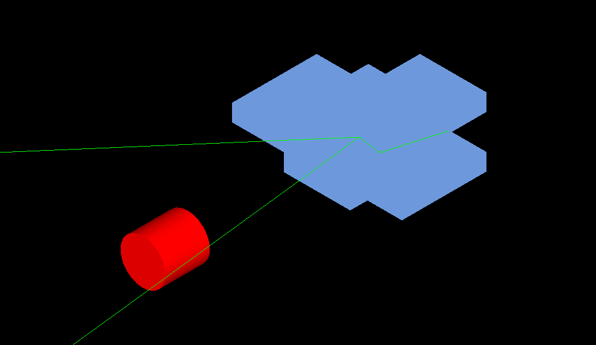
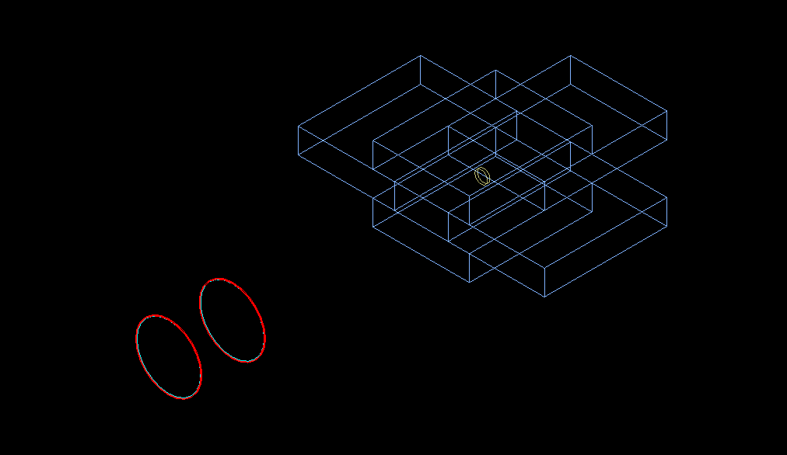

# NaI_Scint

## Sodium Iodide (NaI(Tl)) Detector Simulation using GEANT4 Toolkit

This repository contains the simulation of a **Sodium Iodide NaI(Tl)** detector using the **GEANT4** toolkit.

---

<div align="center">
  
  
</div>

---

### Geometry Definition

The simulation setup consists of:

- A small **NaI(Tl)** cylinder surrounded by a **MgO** reflector.
- The setup is further enclosed by **Al housing**.
- The source is surrounded by **lead bricks** for shielding.

---

### How to Get Started

1. **Read the Code**: Start by looking at the `sim.cc` file. This file contains the main setup and demonstrates how mandatory and optional user action classes are instantiated and registered.
  
2. **Explore the Source Files**: In the `src/` and `include/` directories, explore the following key classes:
    - **DetectorConstruction**: Defines the geometry of the setup.
    - **PhysicsList**: Sets up the physics processes.
    - **SteppingAction**: Handles actions at each step of the simulation.
    - **EventAction**: Manages actions during the event processing.

    Try to understand how these pieces fit together to build the simulation.

3. **Build and Run the Simulation**:
   - Compile and generate an executable using **CMake**. To do this:
     1. Create a new directory, `build`, to build and execute the simulation:
        ```bash
        % mkdir build
        % cd build
        % cmake ..
        % make -jN
        ```
     2. Once the build is complete, run the simulation with:
        ```bash
        % ./NaI
        ```

---

### NaI(Tl) Properties

| Property                 | Value                                      |
|--------------------------|--------------------------------------------|
| **Components**            | Na and I in a 1:1 ratio (molar masses: 22.990 g/mole and 126.904 g/mole) |
| **Density**               | 3.67 g/cm³                                 |
| **Refraction Index**      | 1.85                                       |
| **Absorption Length**     | 1 m                                        |
| **Scintillation Yield**   | 38 photons/keV                             |
| **Fast Time Constant**    | 240.0 ns                                   |

---

This repository provides the detailed simulation setup and properties for the **NaI(Tl)** scintillator detector using the **GEANT4** toolkit.
